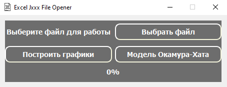

Excel Jxxx-file Opener
======================
### ***Вид главного окна***

*Здесь расположены три кнопки:*
+ *"Выбрать файл"*
+ *"Пострить графики"*
+ *"Модель Окамура-Хата"*

При нажатии на *"Выбрать файл"* открывается окно для выбора .xlsx файла.
В нашем случае это [J004.xlsx](https://github.com/ferret22/excel_Jxxx_opener/blob/master/J004.xlsx).

После появится окно об открытие файла:

### *Окно "Модель Окамура-Хата"*

Открывается при нажатии кнопки *"Модель Окамура-Хата"*.

Подробнее можно прочесть на [Wiki](https://en.wikipedia.org/wiki/Hata_model), либо в этом  [файле](https://edu.study.tusur.ru/publications/4132/download).

**!** Для этого окна не требуется .xlsx файл

### *Графики*
**!** Для этого окна требуется .xlsx файл

После нажатия *"Пострить графики"* запустится процесс построения графиков.
В среднем он занимает ~5-7 мин. Во время этого, лучше не нажимать на окно программы.
Также процесс повторится 2 раза. Т.е. нужно дождаться пока программа откроет 4 окна с графиками.

Вид графиков зависит от данных в .xlsx файле.

### *Данные в .xlsx файле*
Данные в фале выглядят следуещим образом.

В нашем случае это [J004.xlsx](https://github.com/ferret22/excel_Jxxx_opener/blob/master/J004.xlsx).

**!** В файле порядка 30 тысяч строк