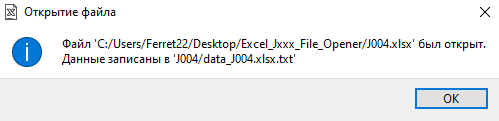

Excel Jxxx-file Opener
======================
## ***Содержание***
- **[Приветсвие](https://github.com/ferret22/excel_Jxxx_opener/tree/master#приветсвие)**
- **[Основная часть](https://github.com/ferret22/excel_Jxxx_opener/tree/master#основная-часть)**
  + **[Вид главного окна](https://github.com/ferret22/excel_Jxxx_opener?tab=readme-ov-file#вид-главного-окна)**
  + **[Окно "Модель Окамура-Хата"](https://github.com/ferret22/excel_Jxxx_opener?tab=readme-ov-file#окно-модель-окамура-хата)**
  + **[Графики](https://github.com/ferret22/excel_Jxxx_opener?tab=readme-ov-file#графики)**
  + **[Данные в .xlsx файле](https://github.com/ferret22/excel_Jxxx_opener?tab=readme-ov-file#данные-в-xlsx-файле)**
  + **[Файлы .txt](https://github.com/ferret22/excel_Jxxx_opener?tab=readme-ov-file#файлы-txt)**
  + **[Запуск через код](https://github.com/ferret22/excel_Jxxx_opener?tab=readme-ov-file#запуск-через-код)**
- **[Завершение](https://github.com/ferret22/excel_Jxxx_opener/tree/master#завершение)**

## ***Приветсвие***
Данная программа предназначена для обратботки _специальных_ файлов .xlsx и построения графиков по данным из этих файлов.

Этот проект является результатом моей курсовой работы.

А этот репозиторий я создал, из интераса в изучении [Git](https://git-scm.com/) и [GitHub](https://github.com/).

 

## ***Основная часть***
### ***Вид главного окна***

*Здесь расположены три кнопки:*
+ *"Выбрать файл"*
+ *"Пострить графики"*
+ *"Модель Окамура-Хата"*

При нажатии на *"Выбрать файл"* открывается окно для выбора .xlsx файла.
В нашем случае это [J004.xlsx](https://github.com/ferret22/excel_Jxxx_opener/blob/master/J004.xlsx).

После появится окно об открытие файла:

### ***Окно "Модель Окамура-Хата"***

Открывается при нажатии кнопки *"Модель Окамура-Хата"*.

Подробнее можно прочесть на [Wiki](https://en.wikipedia.org/wiki/Hata_model), либо в этом  [файле](https://edu.study.tusur.ru/publications/4132/download).

**!ВАЖНО** Для этого окна не требуется .xlsx файл

### ***Графики***
**!ВАЖНО** Для этого окна требуется .xlsx файл

После нажатия *"Пострить графики"* запустится процесс построения графиков.
В среднем он занимает ~5-7 мин. Во время этого, лучше не нажимать на окно программы.
Также процесс повторится 2 раза. Т.е. нужно дождаться пока программа откроет 4 окна с графиками.

Вид графиков зависит от данных в .xlsx файле.

### ***Данные в .xlsx файле***
Данные в фале выглядят следуещим образом.

В нашем случае это [J004.xlsx](https://github.com/ferret22/excel_Jxxx_opener/blob/master/J004.xlsx).

**!ВАЖНО** В файле порядка 30 тысяч строк

### ***Файлы .txt***
Во время работы программы будет создана папка с файлами .txt, котрые будут содержать данные из файла .xlsx

В название папки и файлов .txt будет содержать название файла .xlsx

Это позволяет при повторном использование программой того же самого файла .xlsx открывать и строить графики намного быстрее.

### ***Запуск через код***
Для запуска программы через код использовать библиотеки записанные в [requirements.txt](https://github.com/ferret22/excel_Jxxx_opener/blob/master/requirements.txt)

А иммено:
+ openpyxl==3.0.10
+ PySide2==5.15.2.1
+ matplotlib==3.8.3
+ pyexcel==0.7.0
+ pyexcel-xlsx==0.6.0
+ pyexcel-xls==0.7.0

**!ВАЖНО** openpyxl стоит оставить версии 3.0.10, иначе будет ошибка (set object is not subscriptable) при открытие файла .xlsx

## ***Завершение***
В завершение хочу сказать, что работать над этим проектом было очень интерсно.

Если у вас есть какие-то замечания или идеи по данном репозиторию, то welcome to [issues](https://github.com/ferret22/excel_Jxxx_opener/issues). 

Буду рад вашим сообщениям)